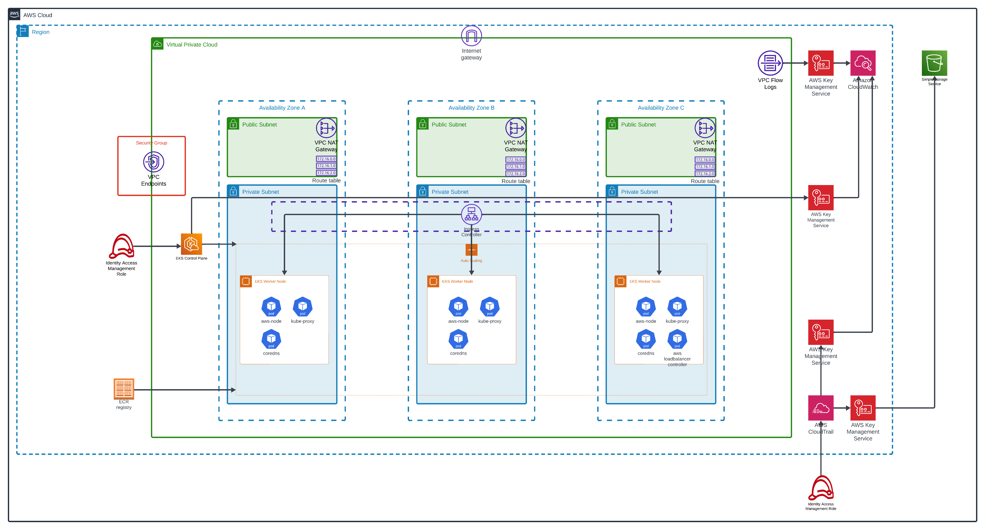

# aws-eks-container-platform

## Description
Terraform for creating an AWS EKS private container platform



This examples demonstrates how to deploy an Amazon EKS cluster that is deployed on the AWS Cloud in private subnets. For that your cluster must pull images from a container registry that's in your VPC, and also must have endpoint private access enabled. This is required for nodes to register with the cluster endpoint.

Please see this [document](https://docs.aws.amazon.com/eks/latest/userguide/private-clusters.html) for more details on configuring fully private EKS Clusters.

For fully Private EKS clusters requires the following VPC endpoints to be created to communicate with AWS services. This example solution will provide these endpoints if you choose to create VPC. If you are using an existing VPC then you may need to ensure these endpoints are created.

    com.amazonaws.region.aps-workspaces            - For AWS Managed Prometheus Workspace
    com.amazonaws.region.ssm                       - Secrets Management
    com.amazonaws.region.ec2
    com.amazonaws.region.ecr.api
    com.amazonaws.region.ecr.dkr
    com.amazonaws.region.logs                       – For CloudWatch Logs
    com.amazonaws.region.sts                        – If using AWS Fargate or IAM roles for service accounts
    com.amazonaws.region.elasticloadbalancing       – If using Application Load Balancers
    com.amazonaws.region.autoscaling                – If using Cluster Autoscaler
    com.amazonaws.region.s3                         – Creates S3 gateway

## Key infrastructure

| Name | Description |
|------|------|
| [vpc]( https://github.com/terraform-aws-modules/terraform-aws-vpc.git) | VPC such that infrastructure is secured on a networking level |
| [vpc-endpoints](https://github.com/terraform-aws-modules/terraform-aws-vpc.git) | Give the VPC access to AWS the required services  |
| [S3-bucket](https://github.com/terraform-aws-modules/terraform-aws-s3-bucket.git) | Logging the CloudTrail trail |
| [kms-keys](https://github.com/terraform-aws-modules/terraform-aws-kms.git) | Encryption for S3 bucket for logging of CloudTaril, encryption to the CloudWatch log groups for CloudTrail trail, VPC flow logs, and EKS cluster |
| [cloudtrail-trail](https://github.com/cloudposse/terraform-aws-cloudtrail.git) | Audit loggging for infrastructure |
| [iam-roles](https://registry.terraform.io/providers/hashicorp/aws/latest/docs/resources/iam_role) | Gives services, relevant permissions, and creates an admin role for administration |
| [eks-cluster](https://github.com/terraform-aws-modules/terraform-aws-eks.git) | EKS cluster where workloads will be computed |


## Pre-requisite
1. Get relevant AWS credentials (Access Key and Access Secret) to apply terraform locally or input credentials into the relevant Pipeline variables
2. Create S3 bucket and configure as Terraform remote backend to store the relevant Terraform statefile
3. Add the state file related values to to the backend block in the version.tf file once created
4. Create an image of a service to be pulled from AWS ECR to use to spin up containers in pods that will be deployed on the EKS cluster

## Usage
```sh
terraform init
terraform fmt
terraform valiate
terraform plan -out=$PLAN
terraform apply -input=false --auto-approve $PLAN
terraform plan -destroy -out=$DESTROY
terraform apply -input=false --auto-approve $DESTROY
```

## Validation after deployment

### Accessing EKS cluster
The EKS cluster is deployed in a private subnet, so only can be managed from 
within the VPC deployed. Spin up an EC2 instance within the VPC and do the 
following installations:

```sh
curl -LO "https://dl.k8s.io/release/$(curl -L -s https://dl.k8s.io/release/stable.txt)/bin/linux/amd64/kubectl"
sudo install -o root -g root -m 0755 kubectl /usr/local/bin/kubectl
sudo yum install -y git
sudo yum install -y yum-utils
sudo yum-config-manager --add-repo https://rpm.releases.hashicorp.com/AmazonLinux/hashicorp.repo
sudo yum -y install terraform
sudo yum remove awscli
curl "https://awscli.amazonaws.com/awscli-exe-linux-x86_64.zip" -o "awscliv2.zip"
unzip awscliv2.zip
sudo ./aws/install
aws --version
```

### Validate from EC2

1. Check the Terraform provided Output, to update your `kubeconfig`

```hcl
Apply complete! Resources: 63 added, 0 changed, 0 destroyed.

Outputs:

configure_kubectl = "aws eks --region eu-west-2 update-kubeconfig --name private-cluster"
```

2. Run `update-kubeconfig` command, using the Terraform provided Output, replace with your `$AWS_REGION` and your `$CLUSTER_NAME` variables.

```sh
aws eks --region <$AWS_REGION> update-kubeconfig --name <$CLUSTER_NAME>
```

3. Test by listing Nodes in in the Cluster.

```sh
kubectl get no
NAME                                        STATUS   ROLES    AGE     VERSION
ip-10-0-19-90.us-west-2.compute.internal    Ready    <none>   8m34s   v1.26.2-eks-a59e1f0
ip-10-0-44-110.us-west-2.compute.internal   Ready    <none>   8m36s   v1.26.2-eks-a59e1f0
ip-10-0-9-147.us-west-2.compute.internal    Ready    <none>   8m35s   v1.26.2-eks-a59e1f0
```

4. Test by listing all the Pods running currently. All the Pods should reach a status of `Running` after approximately 60 seconds:

```sh
kubectl $ kubectl get po -A
NAMESPACE     NAME                       READY   STATUS    RESTARTS   AGE
kube-system   aws-node-jvn9x             1/1     Running   0          7m42s
kube-system   aws-node-mnjlf             1/1     Running   0          7m45s
kube-system   aws-node-q458h             1/1     Running   0          7m49s
kube-system   coredns-6c45d94f67-495rr   1/1     Running   0          14m
kube-system   coredns-6c45d94f67-5c8tc   1/1     Running   0          14m
kube-system   kube-proxy-47wfh           1/1     Running   0          8m32s
kube-system   kube-proxy-f6chz           1/1     Running   0          8m30s
kube-system   kube-proxy-xcfkc           1/1     Running   0          8m31s
```

5. Push an image which cotains a service to private ECR

```sh
podman pull <image>
podman tag <image_name> <ecr_image>
aws ecr get-login-password --region eu-west-2 | docker login --username AWS --password-stdin <ecr_image>
podman push <ecr_image>
```

6. Deploy service from EC2 instance

```sh
kubectl create deployment nginx --image=<ecr_image>
kubectl create service nodeport nginx --tcp=80:80
curl <$NODE_IP>:<$SERVICE_PORT>
```